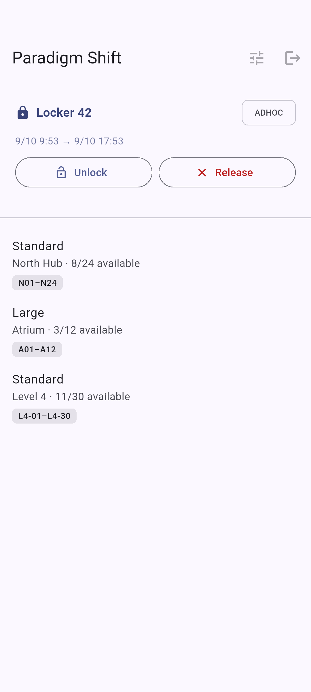
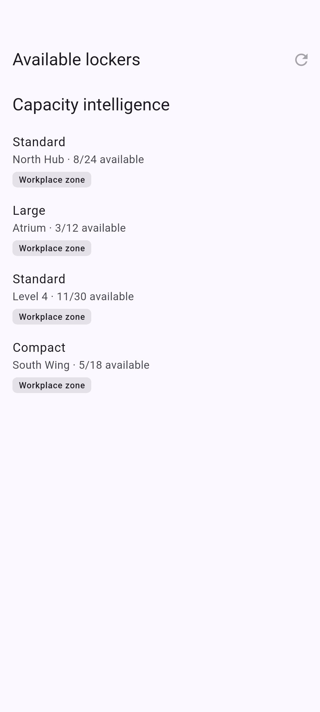
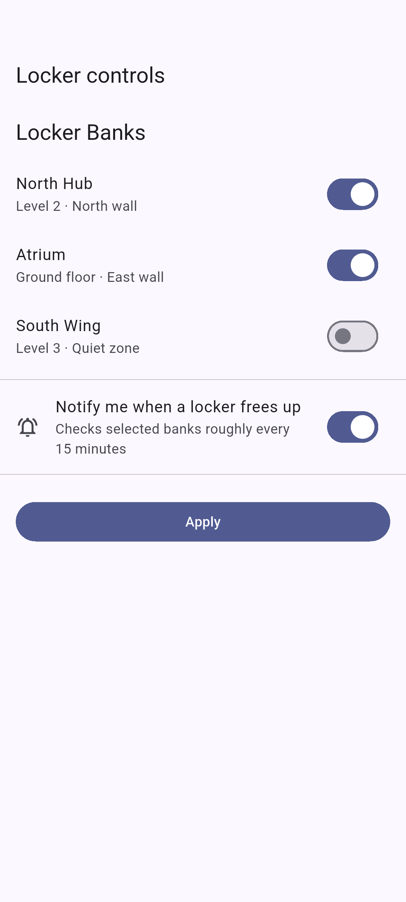

# Paradigm Shift Pressure Plate

A vertically integrated, locker-adjacent workplace enablement platform for organizations seeking to unlock cross-functional synergies across their distributed physical-asset surface area.

Built with Flutter. Powered by stakeholder alignment. Optimized for scalable locker outcomes.

It also happens to interoperate with a certain enterprise smart-locker ecosystem you may already have an account for.

## Strategic value proposition

- Frictionless identity enablement through password and SSO/OIDC workflows
- Multi-site stakeholder orchestration
- Real-time locker capacity intelligence
- Reservation lifecycle management
- High-velocity unlock and release workflows
- Resilient session restoration and connection recovery
- Proactive background availability awareness
- Material 2026-era increases in locker-related synergy

## Product experience

<p align="center">
  
  
  
</p>

These screenshots are generated automatically in CI from deterministic synthetic data. No production credentials, reservation details, site identifiers, or other exciting opportunities for an incident-response retrospective are involved.

## Operating model

You will need:

- Flutter 3.47 or newer
- An account in the compatible locker ecosystem
- The usual platform tooling for whatever rectangle you want to run it on

```bash
cd app
flutter pub get
flutter analyze
flutter test
flutter run
```

## Credential governance excellence

Do not commit live credentials, bearer tokens, site identifiers, signing material, or captured private API responses.

The optional Python smoke client reads `credentials.json`, which is ignored by Git. Copy `credentials.example.json`, populate it locally, and preserve the organization's world-class secret-management posture by not pushing it to GitHub.

## Screenshot automation

The screenshot suite lives in `app/integration_test/screenshot_test.dart`.

GitHub Actions launches a clean Android emulator, renders the UI using synthetic fixture data, writes the images in `docs/screenshots/`, and commits changed screenshots back to `main`. Changes limited to the generated screenshot directory do not trigger the workflow again.

Run it locally with an Android device or emulator:

```bash
./scripts/ci-screenshots.sh <adb-device-id>
```

## Protocol interoperability

High-level interoperability notes live in [docs/PROTOCOL.md](docs/PROTOCOL.md).

The repository intentionally focuses on independently maintained client code rather than redistribution of extracted application assets or a lovingly curated handbook of ways to make physical access controls have a bad quarter.

## Security

See [SECURITY.md](SECURITY.md).

Please disclose authentication, token-handling, or physical-access vulnerabilities privately rather than creating a public Jira ticket for the entire internet.

## License

Original code in this repository is available under the [MIT License](LICENSE).

Third-party services, trademarks, APIs, and applications remain the property of their respective owners, legal departments, strategic partners, and other key stakeholders.
